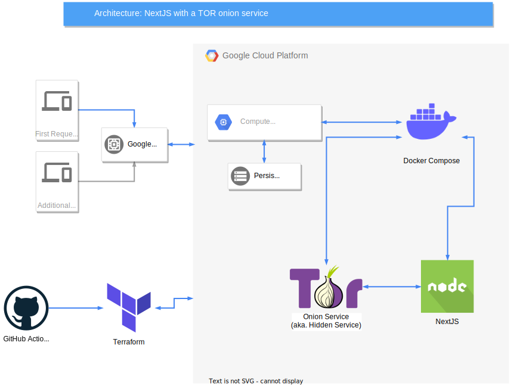

# devgio.xyz

My personal website using [Next.js](https://nextjs.org/) to let people know who I am
and what I do.

## DevOps

One goal of this website is to experiment with different DevOps techniques to deploy code.
This allows me to expand my knowledge base and get insight into the advantages and disadvantages 
of various solutions.

### Requirements

The key requirement is **portability**, meaning that the infrastructure must be easy to change.
Scalability is less important, as the number of users of this web app are predicted to be fairly low.

Because I want to keep the possibility of self-hosting the website on an embedded system, like the Raspberry Pi,
Docker Compose turned out to be very convenient.
Adding a small DB in the future should be straightforward.

### Rejected alternatives 

If I had chosen Google's App Engine or Kubernetes Engine, I would have lost portability, as such an infrastructure
is not reproducible on a single-machine setup.

### Encountered difficulties

Terraform is a great tool to separate concerns and abstract the infrastructure. When the required resources are available
as Terraform resources, the development is accelerated since developers do not have to learn how to use the GUI of the
hosting provider.

However, the resources Terraform provides for the Google Cloud Platform (GCP) were hard to understand.
The documentation of all the different resource arguments could be more detailed.

Furthermore, because Terraform provisions the GCP project itself, creating a service account that gives Terraform the
required permissions in the same project, was not possible. Instead, I had to create an "admin" project that contains
the Terraform service account and is never deleted.
It is quite confusing that a service account needs to be assigned to a project, but can have the permission to
create/modify other projects too. Google's developer team certainly has a reason, but the process would have been
simpler if I could have assigned a service account at the organization level.

## TODOs

- [ ] Avoid leaking `GCP_CREDS` in the workflow logs. Use a GitHub Action to create/update a dedicated secret, instead
of storing the value in an environment variable.
- [ ] Cache `gcloud` to not install it on each run.
- [ ] Store SSH keys generated by `gcloud` correctly instead of generating new ones each time.
- [ ] Delete old deployed code from the hosting machine. Let the developers choose with a single variable how many
codebase copies they want to keep. E.g. keep only 2 codebase copies (the current one and the previous one).
- [ ] Remove the custom firewall if the default ones, with tags `http-server` and `https-server`, suffice.
- [ ] Build the NextJS Docker image on the GitHub Actions instead of on the hosting machine. This would speed up
deployment, since the hosting machine is slower than GitHub Actions' servers.
